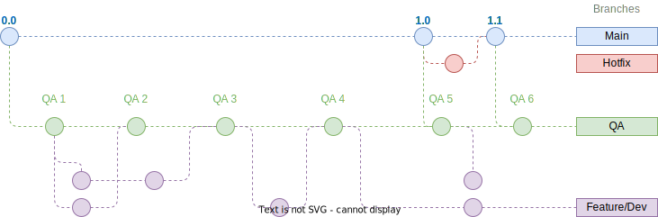

# TSE Group 28 - Game Project

✨ This repo is for the main Unity project 

| Property      | Value       |
|---------------|-------------|
| Unity Version | 2020.3.25f1 |
| LTS           | Yes         |

## Best Practises

The key words "MUST", "MUST NOT", "REQUIRED", "SHALL", "SHALL NOT", "SHOULD", "SHOULD NOT", "RECOMMENDED",  "MAY", and "OPTIONAL" in this document are to be interpreted as described in [RFC 2119](https://datatracker.ietf.org/doc/html/rfc2119).


### 🗣️ Commit Messages

- All commit messages must conform to [Convential Commits](https://www.conventionalcommits.org/) standard.

- In summary, commits should look like this:

```
<type>[optional scope (in brackets)]: <description>

[optional body]

[optional footer(s)]
```


### 🌿 Branches



This repo makes use of branching to maintain multiple different versions of the project.

The `main` branch is the *default branch* that is opened when visiting github.com or when cloning the repo. The `main` branch must **always** be ready for testing, and only contain known good code. This can also be referred to as the `release` branch.

Hotfixes are **quick fixes** to the `main` branch. These should be prefixed with `hotfix/` and then a short description or reference of what is being fixed.

The `QA` branch is where game testing will be completed from. This branch contains code that has been reviewed once, for accuracy/quality. This is used for internal testing. The QA branch is labelled `qa` and **must not** be deleted. They are given an incrementing identification number so they can be referred to easily.

The addition of features must be completed on a **feature branch** (these may also be referred to as a development branch), multiple people can work on one feature if required (directly or with more branching). These can be prefixed in the format of; `yourname/`, `feat/` or `dev/`.

**NB**: To create a new branch run the cmdlet `git checkout -b yourname/feature` which can be incremented by appending numbers to the end.

### 👓 Code Reviews

- Issues and PRs must follow the standard templates.

- Until a PR is ready for review, it must have the label `draft`.

- Once it is ready, remove the `draft` label, and add the `requires-review` label.

- And then request a review from someone.

- Once you've reviewed a PR, remove the `requires-review` label to indicate that it is ready to merge.

- Once the review has been approved, the branch **must only** be merged by PR Assignee.

- PRs will always be in the `main` branch.

- Branches and PRs should be **locked** and **deleted** after merging. *This is only to be done by the PR Assignee.*

### 🚩 Issues

- When issues arise;

- Open an **issue** ticket on the **Github** repo.

- And then, add it to [the task list in Notion](https://www.notion.so/joshcuol/ea67374c885346b684680d48a9756680?v=c0d66886efc540d29006a5d30b4c5ace).

- **Only create a new issue if there is not one already.**

- New features should also be opened as an issue first.

- While working through an issue, you must **update your progress on the Notion Tracker**.

